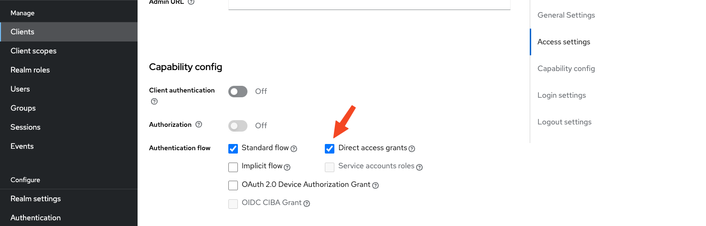
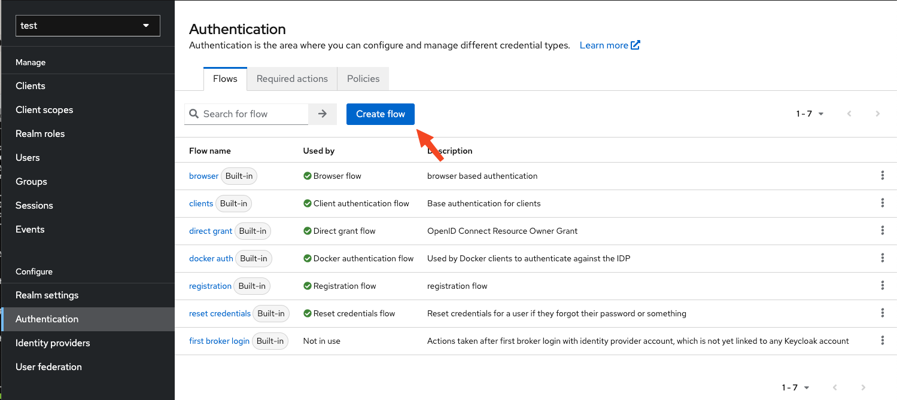
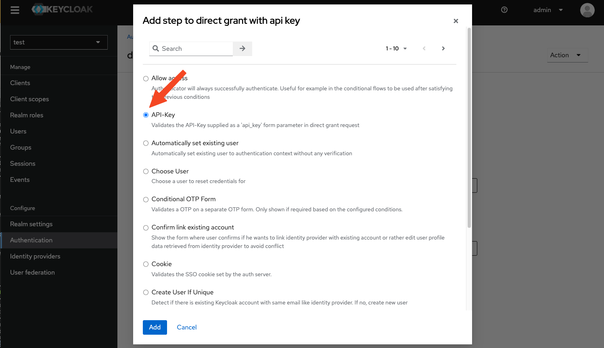
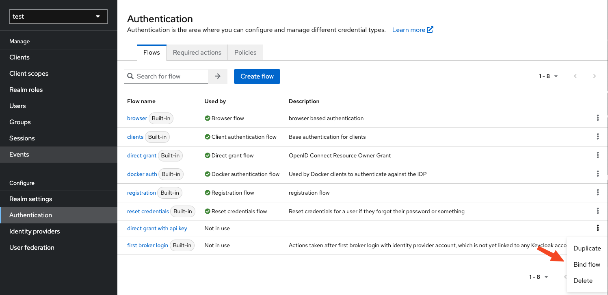
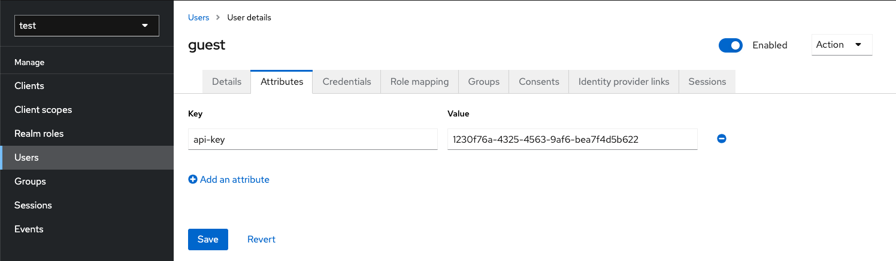
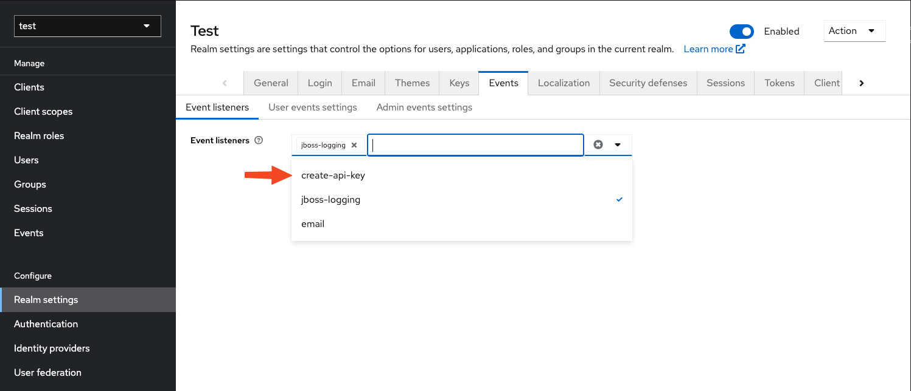

[](https://github.com/treestack/keycloak-api-key-auth/actions/workflows/maven-publish.yml)


# Keycloak API Key authenticator

This Authentication SPI allows the "misuse" of the Resource Owner Password Credentials grant to identify an user by
a pre-generated API key stored as a user attribute. If you want to request tokens to access your application's own
resources, not on behalf of a user,
the [Client Credentials](https://datatracker.ietf.org/doc/html/rfc6749#section-1.3.4) grant
might be a better choice.

**Before using this SPI, please keep in mind that exposing user credentials (that includes API keys) to the outside
world significantly increases the attack surface of your application.**

## Resource Owner Password Credentials grant

OAuth's [Resource Owner Password Credentials](https://datatracker.ietf.org/doc/html/rfc6749#section-1.3.3) (ROPC) grant
type, also known as the "password grant", was designed as a means of migrating legacy authentication mechanisms to an
OAuth tokenized architecture. It essentially swaps user credentials for tokens without properly obtaining the user's
consent or conducting proper identification.

Instead of sending the username and password, we will instead send an API key that's stored as an user attribute and
exchange this API key for a token pair.

### Security implications

Static credentials like API keys can be easily transferred and used in unintended scenarios. You should not allow
access to personal information using only an API key.

Furthermore this mechanism is only suitable for applications where

- the resource owner has a trust relationship with the client,
- proper user identification isn't critical,
- you don't need to gain user consent.

For further information please read this excellent blog post by Scott Brady:
[Don't use the OAuth password grant type](https://www.scottbrady91.com/oauth/why-the-resource-owner-password-credentials-grant-type-is-not-authentication-nor-suitable-for-modern-applications).

## Requirements

This module was developed for Keycloak 22. For earlier versions please see Yogesh Jadhav implementation that inspired
this SPI: https://github.com/carbonrider/keycloak-api-key-module.

## Build and deploy

Execute `mvn package` in the root directory. The deployable JAR file will be created in the `target/`-folder.

Copy the jar file into Keycloaks `providers` directory. If you use the official Docker container you can mount a volume
at `/opt/keycloak/providers`.

## Configuration

Create a client and enable 'Direct access grants'. Please take a moment to consider the ramifications.



Create a new authentication flow:



Choose a name (e.g. "direct grant with api key") and add a single execution:



Set the requirement to "Required" and go back to the authentication flows list to bind your new flow to the direct 
grant flow.



Choose binding type "Direct grant flow" and we're done here.

## Create API key

The API key must be stored as an user attribute. You can either create this manually or add an event handler.

### Create API key manually

After crating a new user, go to the "Attributes" tag and add an attribute named `api-key`:



### Event handler

If you want to generate API keys automatically upon user creation, go to the realm settings and add the 
`create-api-key` event listener.



Now an API key will be generated for you for each new user.

Thanks to https://github.com/p2-inc/keycloak-events for the code!

## Usage

You can now exchange the API key for tokens by sending a POST request to the Token endpoint of your realm, very
similar to the vanilla ROPC grant. But instead of sending the username and password, we will use our API key:

```
curl --location 'http://keycloak:8080/realms/your-realm/protocol/openid-connect/token' \
  --header 'Content-Type: application/x-www-form-urlencoded' \
  --data-urlencode 'grant_type=password' \
  --data-urlencode 'client_id=client-name' \
  --data-urlencode 'api_key=1230f76a-4325-4563-9af6-bea7f4d5b622'
```

### Quarkus OIDC client example

Instead of sending raw POSTs, you could also use [Quarkus' OIDC client](https://quarkus.io/guides/security-openid-connect-client-reference).

```java
@ApplicationScoped
class TokenExchange {
    private final OidcClient client;

    public TokenExchange(@NotNull OidcClient client) {
        this.client = client;
    }

    @NotNull
    public Uni<Tokens> loginWithApiKey(@NotNull String apiKey) {
        var params = new HashMap<String, String>();
        params.put("api_key", apiKey);
        Uni<Tokens> tokens = this.client.getTokens(params);
    }
}
```

Configuration:

```yml
quarkus:
  oidc-client:
    auth-server-url: http://localhost:8081/realms/your-realm
    client-id: client-name
    grant:
      type: password
```
